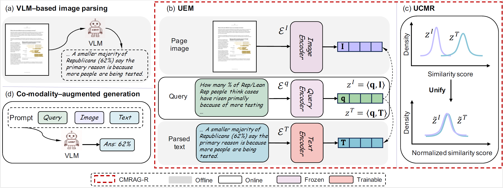

# CMRAG: Co-modality-based visual document retrieval and question answering

This repository contains the official implementation for the paper [CMRAG: Co-modality-based visual document retrieval and question answering](https://arxiv.org/abs/2509.02123). CMRAG proposes a novel framework that simultaneously leverages text and images for more accurate retrieval and generation in document question answering tasks, addressing limitations of existing methods that often struggle with multimodal documents.

<p align="center">
  
</p>

**Figure 1:** An overview of the proposed CMRAG framework. (a) A VLM is prompted to parse visual documents offline. (b) Images, parsed texts, and given queries are encoded uniformly in a shared space. Images and texts can be encoded and indexed offline to accelerate the online RAG systems. (c) The calculated similarity scores of visual and textual modalities are unified to a comparable distribution, ensuring a more accurate retrieval. (d) A VLM generator is prompted to generate the final answer based on the query and retrieved evidence.


## Table of Contents

- [Installation](#installation)
- [Data Download](#data-download)
- [Training the Embedding Model](#training-the-embedding-model)
- [Evaluate the Embedding Model](#evaluate-the-embedding-model)
- [Evaluate the RAG Performance](#evaluate-the-rag-performance)
- [Reference Paper](#reference-paper)

## Installation

1.  **Clone the repository:**

    ```bash
    git clone https://github.com/ChenWangHKU/CMRAG.git
    cd CMRAG
    ```

2.  **Create a Python environment and install dependencies:**

    It is recommended to use a virtual environment. The required packages are listed in `requirements.txt`.

    ```bash
    python3 -m venv venv
    source venv/bin/activate
    pip install -r requirements.txt
    ```

## Data Download

### Training Data

Original training data can be found at: [openbmb/VisRAG-Ret-Train-Synthetic-data on Hugging Face](https://huggingface.co/datasets/openbmb/VisRAG-Ret-Train-Synthetic-data)

The extracted text files are available for download from: [Baidu Netdisk](https://pan.baidu.com/s/1ZyMDk7PT8lDTdFyJP1wTqw?pwd=piyu) (password: `piyu`)

### Testing Data

Testing data is available on Hugging Face: [Yuwh07/CMRAG-Bench](https://huggingface.co/datasets/Yuwh07/CMRAG-Bench)

>The text for the datasets has been extracted using the Qwen2.5-72B-Instruct model. Users can also perform OCR using the provided script: `dataset/img_parser.py`.

## Training the Embedding Model

The embedding model can be trained using the `retriever/train.py` script. An example training command is as follows:

```bash
python -m retriever.train --output_dir <path_to_output_directory> --model_id <model_name> --batch_size <batch_size> --num_epochs <num_epochs>
```

**Example:**

```bash
python -m retriever.train --output_dir ../output_longSigLIP --model_id google/siglip-so400m-patch14-384 --batch_size 32 --num_epochs 12
```

## Evaluate the Embedding Model

To evaluate the trained embedding model, use the `retriever/eval_retriever.py` script. Ensure you provide the path to your trained checkpoint.

```bash
python -m retriever.eval_retriever --ckpt <path_to_checkpoint> --test_data <dataset_name> --results_root <path_to_results>
```

**Example:**

```bash
python -m retriever.eval_retriever --ckpt ../output_longSigLIP/long_siglip-epoch00.ckpt --test_data MMLongBench --results_root ../results/retrieval
```

## Evaluate the RAG Performance

The RAG performance can be evaluated using the scripts in the `evaluation` folder, specifically `LLM_eval.py` and `qa_eval.py`. First, you would typically generate responses using your RAG system, and then evaluate those responses.

**Example for LLM-based evaluation:**

```bash
python -m evaluation.LLM_eval --model_name_or_path Qwen/Qwen2.5-7B-Instruct --save_file <path_to_generated_responses.json>
```

**Example for QA evaluation (EM/F1 scores):**

```bash
python -m evaluation.qa_eval --save_file <path_to_judged_responses.json>
```

## Reference Paper

```bibtex
@article{Chen2025CMRAG,
  title={CMRAG: Co-modality-based visual document retrieval and question answering},
  author={Chen, Wang and Yu, Wenhan and Qi, Guanqiang and Li, Weikang and Li, Yang and Sha, Lei and Xia, Deguo and Huang, Jizhou},
  journal={arXiv preprint arXiv:2509.02123},
  year={2025}
}
```
